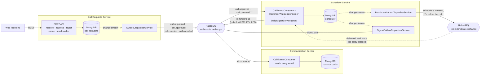
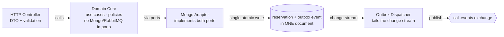
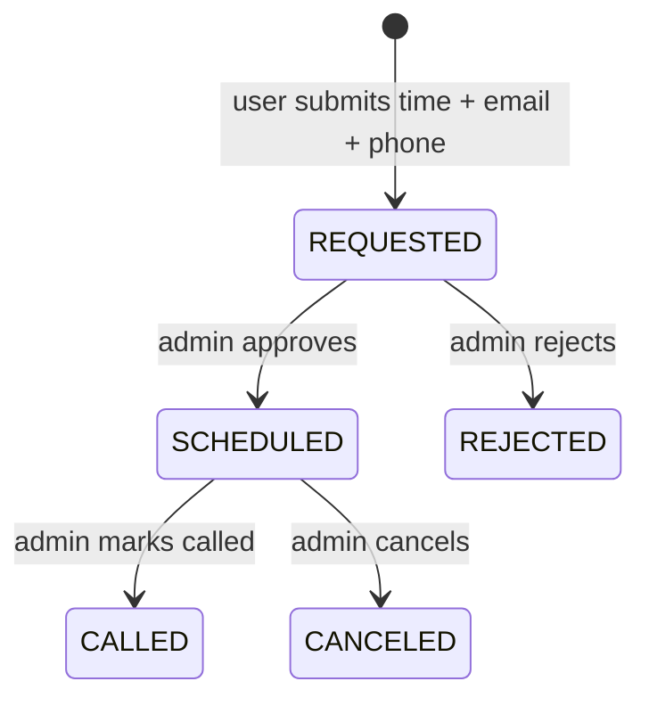

# Call Reservation System

Backend for booking a 30-minute call with an admin, implemented as three
NestJS services plus a React frontend, communicating over MongoDB and
RabbitMQ. This document covers
how to run the project, how it is structured, and the assumptions and
decisions made during implementation.

## Table of contents

- [Tech stack](#tech-stack)
- [High-level architecture](#high-level-architecture)
  - [Which event goes where, and why](#which-event-goes-where-and-why)
  - [Example: what happens when a user creates a call request](#example-what-happens-when-a-user-creates-a-call-request)
  - [Example: what happens when an admin approves a call](#example-what-happens-when-an-admin-approves-a-call)
  - [Example: what happens when an admin cancels a call](#example-what-happens-when-an-admin-cancels-a-call)
- [Why hexagonal architecture — only in Call Requests Service](#why-hexagonal-architecture--only-in-call-requests-service)
- [No polling: how Scheduler learns about the future](#no-polling-how-scheduler-learns-about-the-future)
- [Call lifecycle & email notifications](#call-lifecycle--email-notifications)
- [Assumptions & architectural decisions](#assumptions--architectural-decisions)
- [Folder structure](#folder-structure)
  - [Inside `call-requests-service` — ports & adapters](#inside-call-requests-service--ports--adapters)
- [Running with Docker](#running-with-docker)
- [Local development](#local-development)
- [Viewing the mock emails](#viewing-the-mock-emails)

## Tech stack

- **Workspace:** Nx monorepo
- **Backend:** NestJS (3 independent applications)
- **Database:** MongoDB (one logical database per owning service)
- **Message broker:** RabbitMQ (topic exchange + delayed-message plugin)
- **Frontend:** React (Vite), calls `call-requests-service` only
- **Infrastructure:** Docker & Docker Compose

## High-level architecture

No service polls another, and no service reads another's database. The
frontend only talks to Call Requests Service over REST. Everything else —
Scheduler Service and Communication Service — only reacts to events on
RabbitMQ.



### Which event goes where, and why

| Event | Published by | Consumed by | What it triggers |
|---|---|---|---|
| `call.requested` | Call Requests Service | Communication | "We got your request" email to the customer |
| `call.approved` | Call Requests Service | Communication, Scheduler | Communication emails the customer; Scheduler starts tracking this call so it can remind later |
| `call.rejected` | Call Requests Service | Communication | Rejection email to the customer |
| `call.canceled` | Call Requests Service | Communication, Scheduler | Cancellation email to the customer; Scheduler stops tracking the call |
| `reminder.due` | Scheduler Service | Communication | Email to both customer and admin, 2 hours before the call |
| `digest.due` | Scheduler Service | Communication | Daily summary email to the admin |

### Example: what happens when a user creates a call request

1. User picks an available slot and submits the form (email, phone number,
   time). Call Requests Service re-validates working hours and that the
   slot is still free.
2. It writes **one** document: the request as `REQUESTED`, with a
   `call.requested` event embedded right inside that same write. This is
   the **outbox pattern** — the state change and the event it produces land
   together, atomically, so they can never go out of sync, and nothing is
   lost even if RabbitMQ happens to be unreachable at that exact instant.
3. A small background piece inside Call Requests Service — the **outbox
   dispatcher** — is watching that collection's MongoDB change stream. It
   notices the new embedded event, publishes `call.requested` to RabbitMQ,
   and then removes it from the document.
4. Communication Service picks up `call.requested` from RabbitMQ and emails
   the customer: "we got your request."
5. Scheduler Service isn't listening for `call.requested` at all — nothing
   is scheduled yet, since no admin has approved it.

### Example: what happens when an admin approves a call

1. Admin clicks **Approve**. Call Requests Service writes one update: the
   call's status flips to `SCHEDULED`, with `call.approved` embedded in
   that same write — the same outbox pattern as above.
2. Its outbox dispatcher relays `call.approved` to RabbitMQ.
3. Communication Service sees it and emails the customer.
4. Scheduler Service sees it too, and runs the *same pattern on its own
   database*: it writes a local record for this call (customer email, time,
   admin email), with a reminder wakeup — timed for 2 hours before the
   call — embedded in that write. This is a second, independent outbox,
   entirely separate from Call Requests Service's; Scheduler's own
   dispatcher relays the wakeup to RabbitMQ's delayed exchange.
5. Two hours before the call, RabbitMQ delivers that wakeup back to
   Scheduler Service. It checks its own database — still `SCHEDULED`? If
   yes, it publishes `reminder.due` **directly** this time, no outbox in
   between: there's no accompanying state change it needs to stay in sync
   with, so if the publish fails, Scheduler just leaves the wakeup message
   unacknowledged and RabbitMQ redelivers it later, retrying the whole
   check-and-publish from scratch.
6. Communication Service picks up `reminder.due` and emails both the
   customer and the admin.
7. Every day at 18:00, Scheduler Service checks its own database for
   tomorrow's calls, writes a digest document into a separate collection —
   a third, small outbox — and its dispatcher relays it as `digest.due`.
   Communication Service emails the admin the summary.

### Example: what happens when an admin cancels a call

1. Admin clicks **Cancel** on a `SCHEDULED` call, an hour before its
   reminder would fire. Call Requests Service writes the status as
   `CANCELED`, with `call.canceled` embedded in the same write; its outbox
   dispatcher relays it to RabbitMQ as before.
2. Communication Service sees `call.canceled` and emails the customer.
3. Scheduler Service also sees it and updates its own local record for that
   call to `CANCELED` — a plain write this time, no event to relay.
4. The reminder wakeup scheduled back when the call was approved is still
   sitting in RabbitMQ's delayed exchange — canceling the call doesn't
   remove it. An hour later, RabbitMQ delivers it anyway. Scheduler checks
   its own database, sees the call is no longer `SCHEDULED`, and just
   discards the wakeup instead of publishing `reminder.due`. No reminder
   email goes out.

See "No polling: how Scheduler learns about the future" below for how
events actually get published, and why Scheduler ends up consuming a
message it sent itself.

## Why hexagonal architecture — only in Call Requests Service

`call-requests-service` is the one service with business rules worth
isolating from infrastructure: working-hours validation, slot-conflict
checks, the call lifecycle state machine, and auth. It is implemented with
ports & adapters (hexagonal architecture):



The domain core (use cases, entities, policies) does not import Mongo,
Mongoose, or amqplib; it depends only on plain TypeScript ports (interfaces).
The infrastructure layer implements those ports as adapters (HTTP
controllers, a Mongo repository, an outbox dispatcher). In practice this
means: each use case is isolated behind its own port, business rules can be
unit-tested with an in-memory repository with no framework or database
dependency, and replacing Mongo would only touch the `infrastructure/`
folder.

For background on this pattern:
[Hexagonal Architecture — Alistair Cockburn](https://alistair.cockburn.us/hexagonal-architecture/).

`scheduler-service` and `communication-service` stay as plain NestJS modules
— no ports, no domain/infrastructure split. Neither has business logic
complex enough to justify the extra layer: Scheduler's job is to hold local
state and know when to fire an event; Communication Service's job is to map
an event to a template and send it. Adding a hexagonal core to either would
add indirection without a corresponding benefit, which is the reason
`call-requests-service` uses this structure and the other two don't.

## No polling: how Scheduler learns about the future

The assignment requires that `scheduler-service` be the only service running
cron jobs or intervals, and that services not poll each other for updates.
Two mechanisms are used to satisfy this.

1. **Outbox relayed by MongoDB change streams, not a poller.** Each service
   that needs to publish an event does so by writing the event into Mongo
   first, then a dispatcher tails a change stream and publishes to RabbitMQ
   when it sees a matching write, clearing the pending record afterward.
   Three independent instances of this run across the two services:
   - Call Requests Service: `pendingEvents` embedded on `CallRequestRecord`,
     in the same atomic write as the state change it describes.
   - Scheduler (reminders): `pendingReminder` embedded on
     `ScheduledCallRecord`, written when `call.approved` is consumed.
   - Scheduler (digest): a standalone `pending-digests` collection, one
     document per not-yet-delivered day, written by the daily cron and only
     deleted after RabbitMQ confirms the publish — a broker outage at
     exactly 18:00 delays that day's digest instead of losing it.

   If a process crashes between the state write and the publish, the
   pending record is picked up on the next change-stream catch-up sweep at
   startup; state and event cannot go out of sync because — for the first
   two — they were written together in one document.

   The outbox event is embedded in the same document instead of living in a
   separate `outbox` collection. A dedicated outbox collection is the more
   common approach and would still get the same atomicity through a Mongo
   transaction, but for a document with a single writer, embedding avoids an
   extra collection and a transaction without adding anything.

2. **Delayed exchange instead of a sweep job for reminders.** When a call is
   approved, the 2-hour-before reminder delay is computed once, at approval
   time, and handed to RabbitMQ's `x-delayed-message` exchange
   (`reminder.delay`) as a wakeup message — itself sent through the outbox
   above. RabbitMQ holds it and delivers it back to Scheduler once the delay
   elapses; no periodic check for due reminders ever runs.

   RabbitMQ has no way to retract a message already sitting in that delayed
   exchange, so canceling a call doesn't remove its pending wakeup — it
   still arrives on schedule. Rather than fight that, Scheduler just
   re-checks the call's current status when the wakeup comes back
   (`ReminderWakeupConsumer`) and only publishes `reminder.due` if it's
   still `SCHEDULED`; otherwise it discards the wakeup and no email goes
   out. This is also the one event published directly rather than through
   the outbox — there's no accompanying state write to keep it in sync
   with, so a failed publish just leaves the wakeup unacknowledged and
   RabbitMQ redelivers it later.

   The only cron job in the system is the once-a-day digest
   (`DailyDigestService`, `@Cron('0 18 * * *')`), which is a genuinely
   time-based trigger rather than a check for changed state.

## Call lifecycle & email notifications



| Trigger | Routing key | Recipient(s) | Purpose |
|---|---|---|---|
| User submits a request | `call.requested` | Customer | Confirms the request was received |
| Admin approves | `call.approved` | Customer | Confirms approval, notes a reminder will follow |
| Admin rejects | `call.rejected` | Customer | Notifies rejection, suggests booking another time |
| Admin cancels a scheduled call | `call.canceled` | Customer | Notifies cancellation |
| 2 hours before the call | `reminder.due` (delayed exchange, scheduled once at approval time) | Customer and Admin | Two emails, one per recipient |
| Daily at 18:00 Europe/Istanbul | `digest.due` | Admin | One email listing every call scheduled for the next day |
| Admin marks a call as Called | — | — | Internal status change only; not part of the assignment's email list, so no email is sent |

Communication Service is the only service that sends email. It holds every
template and contains no business logic beyond mapping a routing key to a
rendered message. See `apps/communication-service/src/templates/`.

## Assumptions & architectural decisions

- **Outbox pattern instead of publishing directly from application code.**
  Writing to MongoDB and then separately calling `rabbitMq.publish(...)` has a
  dual-write problem: if the process crashes, or RabbitMQ is briefly
  unreachable, between the two calls, the state change and the event it
  should have triggered can permanently diverge — a call gets approved in the
  database but `call.approved` never reaches Scheduler or Communication
  Service, with nothing left to detect the gap. This system avoids that by
  never publishing directly from application code: every event is first
  written into MongoDB in the same atomic write as the state change it
  describes (see "No polling" above for the mechanics — `pendingEvents`,
  `pendingReminder`, `pending-digests`), and a separate dispatcher process
  tails that collection's change stream, publishes to RabbitMQ, and only then
  clears the record. A crash at any point before that last step is recovered
  by the dispatcher's startup catch-up sweep, so at-least-once delivery is
  guaranteed without needing a two-phase commit across MongoDB and RabbitMQ.

  **Bonus / possible improvement — a Dead Letter Queue was intentionally left
  out.** Right now a message a consumer keeps failing to process is nacked
  and requeued indefinitely (`channel.nack(message, false, true)`), so a
  persistently broken message — a malformed payload, a bug in one handler —
  would loop forever instead of being set aside. A Dead Letter
  Exchange/Queue, routing a message to a separate queue after N failed
  delivery attempts, is the standard fix for this: it gives an operator
  somewhere to see and replay stuck messages instead of them looping
  silently. It was left out here to keep the messaging topology (exchanges,
  queues, bindings) as small as this assignment's scope needed — adding it
  would mean per-queue retry-count tracking and a second exchange per queue,
  which felt like unnecessary complexity for a project this size.

- **30-minute fixed slots.** Users select a start time from a list of
  pre-computed 30-minute slots (10:00, 10:30, … up to 17:30) instead of
  entering an arbitrary time. This is what `GET /availability` returns, and
  `WorkingHoursPolicy` re-validates it server-side regardless of what the
  client sends. Working hours are 10:00–18:00 Istanbul time, Monday–Friday;
  past dates and same-day bookings are rejected.

- **Double-booking is prevented at the database level, not just in
  application code.** The initial implementation only checked for a
  conflicting request before inserting a new one — two requests for the
  same slot arriving close together could both pass that check before
  either write landed. `CallRequestRecord` now has a partial unique index
  on `scheduledAt`, scoped to `status: REQUESTED | SCHEDULED` (a
  `REJECTED`/`CANCELED`/`CALLED` request frees the slot back up for
  re-booking). A losing concurrent insert now fails with a Mongo duplicate-key
  error, which the repository adapter turns into the same `SlotUnavailableError`
  (409) the pre-check already produced for the non-concurrent case.

- **Single admin, enforced at the database and carried on the wire.**
  `call-requests-service` allows at most one `ADMIN` user, ever — a partial
  unique index on `role` in the `users` collection (`unique_admin_role`, see
  [`user.schema.ts`](apps/call-requests-service/src/contexts/user/infrastructure/mongo/user.schema.ts)),
  the same pattern used to prevent double-booking a slot. A second admin
  registration attempt fails with a 409, both from a friendly pre-check and,
  race-safe, from the index itself.

  Scheduler Service is the one that stamps an admin address onto
  `reminder.due`/`digest.due`, but it has no database or API access to
  `call-requests-service` to look the admin up — per the no-polling
  constraint, it can only learn things from events it already consumes. The
  admin approving a call is authenticated, so `AdminCallRequestsController`
  reads `request.user.email` and includes it on `CallApprovedEvent`.
  Scheduler stores it directly on the `ScheduledCallRecord` it already
  builds from that event, and `ReminderWakeupConsumer` reads it straight off
  that record when it fires a reminder for a specific call.
  `CallCanceledEvent` does not carry it: a call can only be canceled from
  `SCHEDULED`, which only exists because it was approved first, so the
  record's `adminEmail` is already there.

  The daily digest is different — it fires on a schedule regardless of
  whether any call happens to be scheduled for tomorrow, so it can't always
  read the admin's email off a specific call. Instead it reads whichever
  `ScheduledCallRecord` was written most recently across the whole
  collection (`findMostRecentAdminEmail`) — since there is only ever one
  admin, any record ever written carries the right address. If no admin has
  ever approved a call, the digest is skipped for that day with a warning
  log rather than sent to nowhere.

  A system with multiple admins could broadcast the initial `call.requested`
  notification to every admin, then route reminders/digests only to whichever
  admin approved the request — but that needs request-to-admin ownership and
  reassignment handling that's out of scope here.

- **Reminder timing: 2 hours before, to both parties.** The assignment
  document is inconsistent on this point: the call-lifecycle table states
  the reminder fires "exactly 2 hours before" the call, while the
  email-notification list separately states "30 minutes to call, notify both
  customer and admin." The most likely reading is that the "30 minutes"
  figure refers to the call's duration, not a second reminder timed
  independently of the first. Rather than implement a second reminder the
  rest of the document does not otherwise describe, this implementation
  sends a single reminder, 2 hours before the call, to both the customer and
  the admin, which satisfies both the explicit 2-hour requirement and the
  "notify both customer and admin" requirement.

- **Emails are sent through a real SMTP transport (MailHog), not only
  logged.** The assignment states that a `console.log` of the template and
  recipient is sufficient, and Communication Service does log every send
  (with the recipient partially masked). It additionally sends the message
  through `nodemailer` to MailHog, a disposable SMTP catcher with a web UI,
  so the email content can be inspected as a rendered message (from, to,
  subject, body) rather than only a log line. MailHog runs in the same
  Docker Compose stack, so this adds no extra setup.

- **Communication Service dedupes emails by `eventId`.** Every other
  consumer in this system (Scheduler's `upsert(requestId, ...)`) is
  naturally idempotent under RabbitMQ's at-least-once redelivery, because
  its side effect is overwriting state — replaying the same event twice
  produces the same document either way. Sending an email has no such
  natural idempotency: replaying the same event twice sends the email
  twice. `CallEventsConsumer` ([`apps/communication-service/src/consumers/call-events.consumer.ts`](apps/communication-service/src/consumers/call-events.consumer.ts))
  reads the wire-level `eventId` off the incoming payload and claims it in a
  `processed-events` Mongo collection (`eventId` unique index) *before*
  rendering/sending — a claim that fails with a duplicate-key error means
  this event was already handled, so the message is acked without sending
  anything again. If sending fails after a successful claim, the claim is
  released so the inevitable redelivery can actually retry instead of being
  skipped as a false duplicate for an email that never went out. This also
  closes a gap that existed before Scheduler even had an `eventId` to
  forward: `reminder.due` didn't carry one at all. It now reuses the
  `eventId` off the `reminder.wakeup` message that triggered it
  ([`apps/scheduler-service/src/consumers/reminder-wakeup.consumer.ts`](apps/scheduler-service/src/consumers/reminder-wakeup.consumer.ts))
  rather than minting a fresh one per publish — a redelivered wakeup (the
  broker's at-least-once guarantee, e.g. the process dying after a
  successful publish but before the ack lands) reprocesses from scratch and
  would otherwise produce a second `reminder.due` with a different `eventId`,
  invisible to Communication Service's dedup check. Reusing the id closes
  that hole: both publishes carry the same `eventId`, so the second is
  correctly recognized as a duplicate and skipped.

## Folder structure

```
call-reservation-system/
├── apps/
│   ├── call-requests-service/   # REST API · source of truth · hexagonal core + outbox publisher
│   ├── scheduler-service/       # only cron/interval owner · delayed-exchange consumer
│   ├── communication-service/   # email templates · SMTP sender · terminal consumer
│   └── web-service/             # React frontend (User view / Admin view)
├── libs/
│   └── shared-types/            # DTOs, enums, and event-payload contracts shared by every app
├── scripts/
│   ├── docker-compose.yml       # base service definitions
│   ├── docker-compose.dev.yml   # local port-mapping overlay
│   ├── mongodb/                 # replica-set init script (required for Mongo change streams)
│   ├── rabbitmq/                # Dockerfile with the delayed-message plugin baked in
│   ├── services/Dockerfile      # shared multi-stage build for the 3 NestJS apps
│   └── web-service/             # nginx + Dockerfile for the frontend
└── README.md
```

### Inside `call-requests-service` — ports & adapters

```
call-requests-service/src/
├── main.ts
├── app/app.module.ts               # composes the 4 context modules below
├── config/                         # env validation (zod)
├── shared-kernel/                  # technical plumbing, no business rules
│   ├── mongo-connection.module.ts
│   └── rabbitmq/                   # publish-with-confirm + retry
└── contexts/
    ├── user/                       # bounded context — identity: who this person is
    │   ├── domain/                 # entities, value objects
    │   ├── application/            # use cases
    │   └── infrastructure/         # http controller, Mongo schema + repository
    ├── auth/                       # bounded context — login mechanics only, no entity of its own
    │   ├── domain/ports/           # token-issuer port
    │   └── infrastructure/         # controller, JWT guard, roles guard
    ├── call-request/               # bounded context — the aggregate + its lifecycle
    │   ├── domain/
    │   │   ├── entities/call-request.entity.ts
    │   │   ├── policies/           # working-hours policy, lifecycle transition rules
    │   │   └── ports/               # repository port, event-publisher port
    │   ├── application/            # one use case per action: reserve, approve, reject, cancel, mark-called, add-note
    │   └── infrastructure/
    │       ├── http/                # user-facing + admin controllers
    │       ├── mongo/                # repository adapter + schema (embeds the outbox)
    │       └── outbox/               # OutboxDispatcherService — the change-stream relay
    └── availability/                # bounded context — read model derived from call-request
        ├── domain/policies/         # reuses working-hours policy
        └── infrastructure/mongo/    # read-only slot lookup
```

`scheduler-service` and `communication-service` stay flat — a `consumers/`
folder, a `state/` or `templates/` folder, and one `app.module.ts` each; no
`domain/`/`application/`/`infrastructure/` split, for the reasons described
above.

## Running with Docker

The full system — MongoDB, RabbitMQ, MailHog, all three NestJS services, and
the frontend — is fully containerized. As required by the assignment, the
compose files live in `scripts/`, and the stack comes up from there:

```bash
cd scripts
cp .env.example .env
docker compose up --build -d
docker compose ps
```

`scripts/.env`'s `COMPOSE_FILE` value merges `docker-compose.yml` (base
service definitions) with `docker-compose.dev.yml` (a local overlay that
publishes every container's port to `localhost` and supplies default
credentials), so `docker compose up` is sufficient.

Once the stack is healthy:

| Service | URL | Notes |
|---|---|---|
| Frontend | http://localhost:4200 | User view / Admin view |
| Call Requests Service API | http://localhost:3001 | REST API the frontend calls |
| Scheduler Service | — | no HTTP surface; internal only |
| Communication Service | — | no HTTP surface; internal only |
| RabbitMQ Management UI | http://localhost:15672 | user/pass: `reservation` / `reservation` |
| MailHog inbox | http://localhost:8025 | every email sent by the system lands here |
| MongoDB | `mongodb://localhost:27017/?replicaSet=rs0&directConnection=true` | single-member `rs0` replica set (required for change streams) |

To stop the stack while keeping data:

```bash
cd scripts
docker compose down
```

To also remove the MongoDB and RabbitMQ volumes:

```bash
cd scripts
docker compose down --volumes
```

## Local development

For faster iteration than rebuilding Docker images on every change, run only
the infrastructure containers and run the NestJS/React apps on the host via
Nx:

```bash
# 1) infra only — MongoDB (as a replica set), RabbitMQ (with the delayed
#    exchange plugin) and MailHog
cd scripts
cp .env.example .env
docker compose up -d mongodb mongodb-init rabbitmq mailhog

# 2) each app's own .env, pointing at the ports exposed above
cd ..
cp apps/call-requests-service/.env.example apps/call-requests-service/.env
cp apps/scheduler-service/.env.example apps/scheduler-service/.env
cp apps/communication-service/.env.example apps/communication-service/.env
cp apps/web-service/.env.example apps/web-service/.env

# 3) run every app in watch mode via Nx
npm install
npm run dev   # nx run-many -t serve --parallel=4
```

Each service can also be served individually, e.g.
`npx nx serve call-requests-service`. Other commands:

```bash
npm test              # nx run-many -t test — unit tests for every project
npm run lint          # nx run-many -t lint
```

## Viewing the mock emails

Communication Service is the only service that sends email. Two ways to
inspect what was sent:

- **MailHog UI:** http://localhost:8025 — every email as a rendered message
  (from/to/subject/body), for the whole run.
- **Docker logs:** `docker compose logs -f communication-service` (from
  `scripts/`) — every send is logged with the recipient partially masked,
  e.g. `j***n@example.com`.
